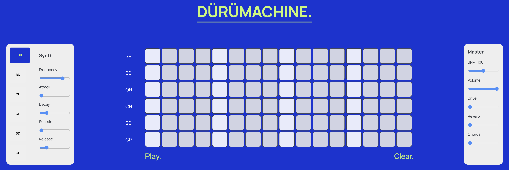

# DÜRÜMACHINE.

*A drum sequencer with tweakable parameters, FX as well as a custom UI that works in the browser, built with Tone.js.*

# How to intall:

1. Clone repository

2. Start local server via Python (make sure to intall the latest Python version). This is necessary for laoding in the samples.
``python3 -m http.server`` 

3. Open your browser and go to localhost:8000

4. Have fun!
